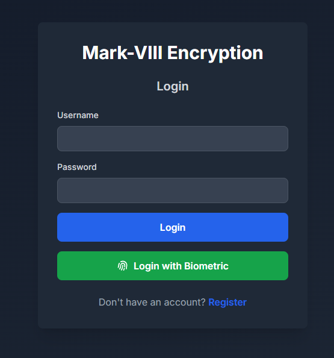
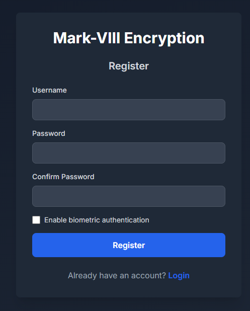
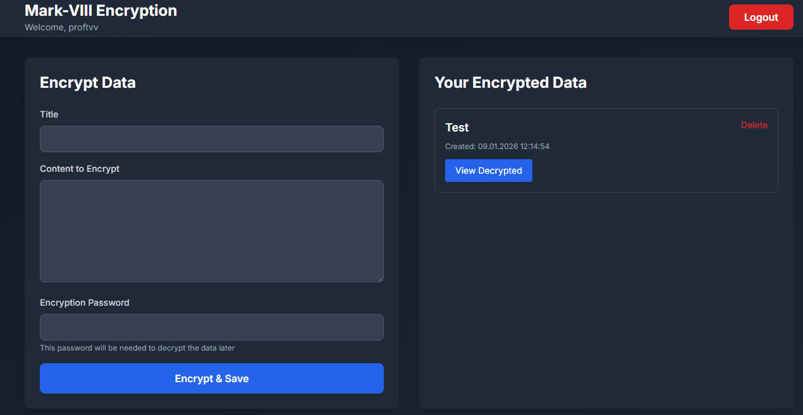

<div align="center">

# 🔐 Mark-VIII Encryption System

### Military-Grade Encryption for Your Personal Data

[](https://nextjs.org/)
[](https://reactjs.org/)
[](https://www.typescriptlang.org/)
[](https://tailwindcss.com/)

**Cross-platform encryption solution with biometric authentication for Windows & Android**

[Features](#-features) • [Installation](#-installation) • [Usage](#-usage) • [Security](#-security) • [Deployment](#-deployment)

</div>

---

## 🌟 Features

<table>
<tr>
<td>

### 🔒 Security First
- **AES-256 Encryption** - Military-grade encryption
- **Bcrypt Hashing** - Secure password storage
- **WebAuthn Biometric** - Fingerprint & Face ID
- **Zero-Knowledge** - Your keys, your data

</td>
<td>

### 🌐 Cross-Platform
- **Windows Desktop** - Full browser support
- **Android Mobile** - Progressive Web App
- **Responsive Design** - Works everywhere
- **Offline Capable** - Local database

</td>
</tr>
<tr>
<td>

### 🎨 Modern UI/UX
- **Tailwind CSS** - Beautiful & fast
- **Dark Mode** - Easy on the eyes
- **Mobile-First** - Touch optimized
- **Accessible** - WCAG compliant

</td>
<td>

### ⚡ Performance
- **Next.js 14** - Lightning fast
- **SQLite** - Local storage
- **Type-Safe** - Full TypeScript
- **Optimized** - Production ready

</td>
</tr>
</table>

---

## 📸 Screenshots

<div align="center">

### Login & Authentication
 

### Dashboard & Encryption


</div>

---

## 🚀 Installation

### Prerequisites

```bash
# Node.js 18 or higher
node --version  # Should be v18.0.0 or higher

# npm (comes with Node.js)
npm --version
```

### Quick Start

```bash
# 1. Clone the repository
git clone https://github.com/proftvv/Mark-VIII.git
cd Mark-VIII

# 2. Run the installer (Windows)
install.bat

# 3. Install dependencies
npm install

# 4. Start development server
npm run dev

# 5. Open in browser
# http://localhost:3000
```

### Manual Installation

If the installer doesn't work:

```bash
# Create project structure
node create_structure.js
node create_components.js
node create_api.js

# Install dependencies
npm install

# Start server
npm run dev
```

---

## 📱 Android Access

Access from your Android device on the same WiFi network:

```bash
# 1. Find your computer's IP address
ipconfig
# Look for "IPv4 Address" (e.g., 192.168.1.100)

# 2. On Android browser, open:
http://YOUR-IP:3000
# Example: http://192.168.1.100:3000
```

---

## 💡 Usage

### 1. Register Account

```
1. Click "Register" button
2. Enter username and password (min 6 characters)
3. Optional: Enable biometric authentication
4. Click "Register"
```

### 2. Login

**Password Login:**
```
1. Enter credentials
2. Click "Login"
```

**Biometric Login:**
```
1. Enter username
2. Click "Login with Biometric"
3. Use fingerprint/face recognition
```

### 3. Encrypt Data

```
1. Enter title for your data
2. Type/paste content to encrypt
3. Set encryption password
4. Click "Encrypt & Save"
```

⚠️ **Important:** Encryption passwords cannot be recovered. Store them securely!

### 4. Decrypt & View

```
1. Click "View Decrypted" on any item
2. Enter encryption password
3. Click "Decrypt"
```

---

## 🔐 Security

### Encryption

- **Algorithm**: AES-256-CBC
- **Library**: CryptoJS 4.2.0
- **Key Derivation**: PBKDF2
- **Client-Side**: All encryption happens in browser

### Authentication

- **Password Hashing**: bcrypt with 10 salt rounds
- **Biometric**: WebAuthn API (FIDO2 standard)
- **Session**: Secure session management
- **Protection**: SQL injection prevention

### Database Schema

```sql
-- Users table
CREATE TABLE users (
  id INTEGER PRIMARY KEY AUTOINCREMENT,
  username TEXT UNIQUE NOT NULL,
  password_hash TEXT NOT NULL,
  created_at DATETIME DEFAULT CURRENT_TIMESTAMP
);

-- Encrypted data table
CREATE TABLE encrypted_data (
  id INTEGER PRIMARY KEY AUTOINCREMENT,
  user_id INTEGER NOT NULL,
  title TEXT NOT NULL,
  encrypted_content TEXT NOT NULL,
  created_at DATETIME DEFAULT CURRENT_TIMESTAMP,
  updated_at DATETIME DEFAULT CURRENT_TIMESTAMP,
  FOREIGN KEY (user_id) REFERENCES users(id) ON DELETE CASCADE
);
```

---

## 🛠️ Tech Stack

### Frontend
- **Framework**: Next.js 14 (App Router)
- **UI Library**: React 18
- **Language**: TypeScript 5.3
- **Styling**: Tailwind CSS 3.4
- **Icons**: Heroicons

### Backend
- **API**: Next.js API Routes
- **Database**: Better-SQLite3
- **Encryption**: CryptoJS
- **Auth**: bcryptjs, WebAuthn

### Development
- **Package Manager**: npm
- **Linting**: ESLint
- **Type Checking**: TypeScript
- **Build Tool**: Next.js Compiler

---

## 📦 Project Structure

```
Mark-VIII/
├── app/
│   ├── globals.css           # Global styles
│   ├── layout.tsx            # Root layout
│   └── page.tsx              # Home page
├── components/
│   ├── LoginForm.tsx         # Login component
│   ├── RegisterForm.tsx      # Registration
│   ├── Dashboard.tsx         # Main dashboard
│   ├── EncryptionPanel.tsx   # Encrypt interface
│   └── DataList.tsx          # Data management
├── lib/
│   ├── database.ts           # SQLite setup
│   ├── encryption.ts         # AES functions
│   └── biometric.ts          # WebAuthn
├── pages/api/
│   ├── auth/
│   │   ├── login.ts         # Login endpoint
│   │   └── register.ts      # Register endpoint
│   └── data/
│       ├── save.ts          # Save data
│       ├── list.ts          # List data
│       └── delete.ts        # Delete data
└── public/                   # Static assets
```

---

## 🌐 Deployment

### Local Development (Recommended)

```bash
npm run dev
```

Access:
- **Windows**: http://localhost:3000
- **Android** (same WiFi): http://YOUR-IP:3000

### Vercel Deployment

⚠️ **Important**: SQLite doesn't work on Vercel's serverless platform.

**For Vercel deployment**, you need to:

1. **Set up Vercel Postgres**:
   ```bash
   # Install Vercel CLI
   npm install -g vercel
   
   # Login to Vercel
   vercel login
   
   # Deploy (will prompt for Postgres setup)
   vercel
   ```

2. **Configure Database**:
   - Vercel Dashboard → Storage → Create Database → Postgres
   - Environment variables will be auto-added
   
3. **Update Database Code**:
   - Replace `lib/database.ts` with Postgres implementation
   - See `VERCEL_DEPLOY.md` for details

4. **Deploy to Production**:
   ```bash
   vercel --prod
   ```

**Alternative**: Use the app locally with SQLite (works perfectly for development and personal use).

---

## 📝 Available Scripts

```bash
npm run dev      # Start development server
npm run build    # Build for production
npm start        # Start production server
npm run lint     # Run ESLint
```

---

## 🔧 Configuration

### Environment Variables (Optional)

Create `.env.local`:

```env
# Database (for Vercel)
POSTGRES_URL=your_postgres_url
POSTGRES_PRISMA_URL=your_prisma_url

# Session (optional)
SESSION_SECRET=your_random_secret
```

---

## 🐛 Troubleshooting

### Common Issues

| Issue | Solution |
|-------|----------|
| `npm install` fails | Ensure Node.js 18+, try `npm cache clean --force` |
| Port 3000 in use | Use `npm run dev -- -p 3001` |
| Can't access from Android | Check same WiFi, verify firewall |
| Biometric not working | Requires HTTPS or localhost |
| Database locked | Close app, delete `.db-wal` files |

### Support

1. Check [INSTALLATION_GUIDE.md](./INSTALLATION_GUIDE.md)
2. Review [troubleshooting section](#-troubleshooting)
3. Open an issue on GitHub

---

## 📚 Documentation

- 📖 [Installation Guide](./INSTALLATION_GUIDE.md) - Detailed setup
- 📖 [Quick Reference](./QUICK_REFERENCE.md) - Command reference
- 📖 [Implementation Summary](./IMPLEMENTATION_SUMMARY.md) - Technical details
- 📖 [Start Here](./START_HERE.txt) - Quick start guide

---

## 🗺️ Roadmap

- [ ] Password recovery system
- [ ] File encryption support
- [ ] Data export/import
- [ ] Mobile app (React Native)
- [ ] Multi-factor authentication
- [ ] Cloud synchronization
- [ ] Encrypted backups
- [ ] Password strength meter
- [ ] Sharing functionality
- [ ] Admin dashboard

---

## 🤝 Contributing

This is a private project. For suggestions or bug reports:

1. Fork the repository
2. Create a feature branch
3. Commit your changes
4. Push to the branch
5. Open a Pull Request

---

## 📄 License

Private project - All rights reserved

---

## 👨‍💻 Author

**proftvv**

- GitHub: [@proftvv](https://github.com/proftvv)
- Project: [Mark-VIII](https://github.com/proftvv/Mark-VIII)

---

## 🙏 Acknowledgments

- Next.js team for the amazing framework
- Vercel for hosting platform
- CryptoJS for encryption library
- All open-source contributors

---

<div align="center">

### ⭐ Star this repository if you find it helpful!

**Made with ❤️ for security and privacy**

[Report Bug](https://github.com/proftvv/Mark-VIII/issues) • [Request Feature](https://github.com/proftvv/Mark-VIII/issues)

</div>
